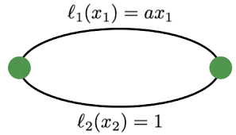
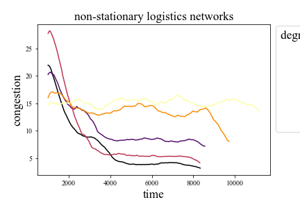

# DeCongested: where self-organization can promote circularity in logistics

## Overview
DeCongested is a repository built and maintained by the Computational Social Science group at ETHZ, supported by the ’Co-Evolving City Life - CoCi’ project through the European Research Council (ERC) under the European Union’s Horizon 2020 research and innovation programme (grant agreement No. 833168).

The broad research question from this ERC grant is:
> How can self-organization and resilience principles be used in a way that makes cities more sustainable?

This particular project focuses on transport and logistics and studies the ability of learning agents that leverage local information sharing to become more circular.

The specific research question for this repository is:
> How are the dynamics of a system of deep $Q$-learners that share model parameters (as in federated learning) affected when collaboratively solving congestion games in networks?

### Repository Contents
- dqn_agent contains the functions to run a Deep Q-Learning model
- dqn_grid runs a DQN agent in the specified environment
- dqn_grid_results is a helper jupyter notebook designed to plot and analyze the results from runs from dqn_grid
- environment contains the environment classes that implement the decentralized and asynchronous multi-player atomic routing simulation

## Background
Multi agent systems require coordination to achieve system optimal performance. Except for few simple cases, this coordination can not be achieved without explicit collaboration, reliably. 

Cities create the playground within which a rich multi agent system can develop. Within this multi agent system we can identify many simultaneous, concurrent 'games' that citizens 'play' (quotation marks to emphasize that we are using these terms before defining them rigorously). Games characterized by players, actions, and utility functions over the actions of all players, are simplified settings within which equilibrium concepts (Nash Equilibrium, Correlated Equilibrium) or non-equilibrium dynamics (Limit Cycles, Chaos) can be rigorously defined and studied. In this project we focus on the games that can be found in transportation and logistics like route choice, pickup and delivery, and packet routing, which are aptly subsumed by congestion games and variants thereof. 

> N.B. Cities are open systems, which means that the games played locally by a subset of individuals may have consequences for the players of the many concurrent games that occur in the neighbourhood of the game. In cities, traffic jams on single roads can have consequences that extend beyond those roads, even beyond traffic: e.g. drivers change their paths to avoid that road, drivers take to walking or public transport, pollution levels increase which may affect the value of real estate. 

### Games and the Economy

### The Circular Economy
The circular economy is a term used to describe a new economic system defined by a set of practices and perspectives which, in their application, differ from the current economic system. The circular economy is proposed in contrast to the linear economy which is believed to be largely in place today. In fact we do not know very well what the circular economy is. The EU defines the Circular Economy as:

> `a model of production and consumption, which involves sharing, leasing, reusing, repairing, refurbishing and recycling existing materials and products as long as possible. In this way, the life cycle of products is extended'.

In this definition are featured the producers and consumers of an economy in relation to the goods which the economy produces. This definition also lists some central practices which producers and consumers can apply, namely sharing, leasing, reusing, repairing, refurbishing and recycling. For the EU a successful circular economy will enable the material goods in an economy to remain part of the economy, and maintain or transform their value without becoming waste that has lost intrinsic value and must be disposed.

#### The role of Information in the Circular Economy

It is clear that, though not present in the above definition, maintaining or transforming the value of a good which has lost value to its original owner requires, as all economic processes do, the knowledge of the existence of both the original owner and the next possible owner which can equally value the good, or the process by which the good can be transformed to a next form which is then valued by the next possible owner equally. 

What we hope to have emphasized is that knowledge and knowledge exchange are the fundamental processes that allow an economy to organize and will allow a circular economy to adapt existing goods to the present demands for the future demands. This is the case whether or not the economy is circular. But, does knowledge exchange in a circular economy differ from that in a linear economy?

We may not be able to give a satisfactory answer to this question at this stage. We believe this to be a rather contentious point. Many conceptions of the circular economy will portray economic processes as exchanges that occur under increased collaboration between economic agents when compared to present day linear economic processes. If such a view of the circular economy is taken to be true, then can it be argued that the knowledge exchange processes are different in the one and the other forms of economy? We briefly give two arguments, one in support and the other against.

We present the argument against as follows: knowledge exchange in the circualr economy is not fundamentally different, because the same economic principles apply; economic agents take into their utility functions the actions that are dictated by circular economic practices like sharing, reusing (... etc.). They provide this knowledge and obtain this knowledge because it is beneficial to them. While this knowledge may be in some sense new, or in the very least new in the scale at which the circular economy requires it to be known, it is nonetheless the same processes which dictate its exchange.

Now we present the argument for a difference. While it is true that the knowledge processes may be fundamentally unchanged, what we argue to be different is the relative proportion of competition to collaboration, and we believe this to be a significant enough difference that the empirically observable processes by which knowledge is exchanged will appear to be new. In a circular economy where collaborative knowledge sharing is prioritized over competitive knowledge acquisition we expect the economy to tend towards different equilibria and to settle into different dynamics which will not be intelligible to analysis which does not take into account the difference in the knowledge process exchange.  

We leave to the interested reader the choice of which argument they find most compelling, and proceed to introduce the next topic which we will require discussing to elucidate the project further, because we believe that the product-centric view presented in the EU definition above misses a critical system of the economy which underlies all exchanges: the supply chain.

#### Supply chain in the circular economy

*Supply chains are to the economy what the electrical grid is to the internet, what the arteries and veins are to animal bodies.*

The circular economy defined for the producers and consumers has the clear target of the products. Producers should find ways to reuse and recycle materials in their pipelines. Consumers should find ways to similarly, reuse and share products they have purchased and seek to repair and refurbish their used goods. Again this is a very product centered, materials focused perspective which is necessary for this relationship. But if we think of supply chains, the infrastructure of the economy, which is not concerned with the products themselves, but with the distribution and connections that enable these products to be exchanged; what is then circularity for a supply chain?

In this research we will focus on information as a key component of supply chain circularity in its effects on the use of shared resources. The information available to the participants in a supply chain is often partial and incomplete which can lead to an ineffective use of share resources like road networks, shipping containers, and warehouses. Moreover, the participants in supply chains can be both independent actors in competition and coordinated players of the same company. Therefore, a variety of tools from game theory can be useful to analyze the systems. In this research we will focus on the case of shared resource games, also known as congestion games, which have been often used to model congestion in traffic on roads and the internet. We will consider cases where the shared resources are subject to exogenous shocks and assess the ability of the supply network to adapt and recover from the changes to the underlying network. In particular, we will assess the differences in dynamics that are due to a degree of centralization: a fully decentralized network is one where all actors are independent and make their decisions by considering information available to them locally, while a fully centralized network is guided by a unique decision maker which has access to all the global information to coordinate the individual actors.

### Congestion Games

Congestion games are defined as $N$ players sharing a set of $K$ resources, where the utility of using resource $k\in K$ given that $m$ players pick $k$ is a monotonically decreasing function $u_k(m)$ in $m$. In other words, when many players pick the same resource they 'congest' and reduce the experienced utility for each other. We can readily imagine such situations in traffic: when many drivers pick the same road they create traffic jams which slow everyone down.

In this paper we take MDP congestion games as our ground model, create a simulation framework to test reinforcement learning algorithms, and explore the online collaborative learning potential of reinforcement learning agents that learn to be more circular over time by sharing their knowledge and experience of the networked repeated congestion games that they play.

**Congestion Games** complexity of pure NE \cite{fabrikant2004complexity}. For symmetric games, pure NE can be computed in polynomial time with the potential function. For general games complexity is PLS-complete. Atomic Congestion Games introduced in \cite{tekin2012atomic}.

**MDP Congestion Games tolling**, changing the reward function, to avoid congestion \cite{li2019tolling}. Considered continuous MDPCG. Also \cite{calderone2017markov} do similar work, with continuous MDPCG. Extended in \cite{li2022congestion} to robot path planning to avoid congestion in warehouses.

**Decentralized Training, Online Learning** \cite{gaborattention} preprint proposing a method for decentralized training. 

**Logistics, Pick-up and Delivery Problems**
A review classification and survey of Static PDP \cite{berbeglia2007static}. Large Neighbourhood Search Heuristics first introduced in \cite{shaw1998using} and very successful for solving routing problems. PDP-TW, for pickups with time windows \cite{ropke2006adaptive}. PDPTW-SL for pickup with time windows and scheduled lines of public transport \cite{ghilas2016adaptive}. Centralized Approaches. Hardly Adaptive. 

**Demand Adaptive Systems** Desiging the master schedule \cite{crainic2012designing}.

### Reinforcement learning

**COMA** achieves difference style rewards \cite{tumer2007distributed}, for counterfactuals, such that agents can compare the what if scenarios of their alternative actions. However, this relies on a centralized critic trained during training. Also from Foerster \cite{foerster2018counterfactual}.

**Learning to Communicate, RIAL** \cite{foerster2016learning} Few agents. Create Deep Learning protocol for differentiable message passing between agents, and solve some simple multi player games: switch riddle (3 and 4 agents), and MNIST games (2 agents). Highly Cited Research.

**MACKRL** uses a common knowledge framework to train a multi agent system of reinforcement learners \cite{schroeder2019multi}. Simply assumes a common knowledge function, accessible in both training and testing to the independent RL agents, in a Dec-POMDP.

**Collective Intelligence for Deep Learning**
\cite{ha2022collective} survey state of the art ways in which multi agent systems are developed with deep learning, for large systems with MANY agents. Many agent reinforcement learning. They break it down into Image Processing, Deep Reinforcement Learning, Multi Agent Learning, and Meta Learning. Cool self-organization on GraphNNs in \cite{grattarola2021learning}. 

### Research Questions
The broad and thematic research question that underlies this project is: how can self-organization and resilience principles be used in a way that makes cities more sustainable?

As we have presented above, this project will focus on the information flows that may allow a logistics network to become more circular over time. A more specific research question on this basis is then: how can circularity be defined in the context of logistics and transportation?

Finally, as we will be addressing these research questions in the specific class of games called congestion games, and with the specific reinforcement learning tool of $Q$-learning, we pose the final and most specific research question that we aspire to answer most completely: How are the stationary solutions of a system of deep $Q$-learners that share model parameters (as in federated learning) affected when collaboratively solving congestion games on a network?

## Preliminary Results

