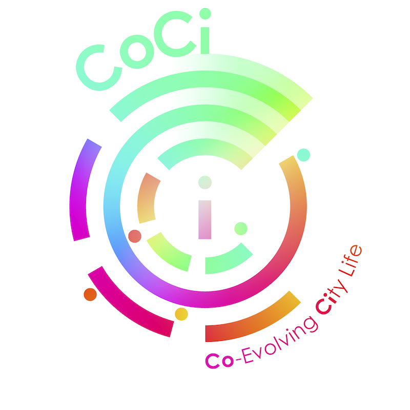

# decongested: transportation that learns to share with self-organization  

## Background

### Routing, route choice, congestion games

### Circular economics, logistics  

### Reinforcement learning

